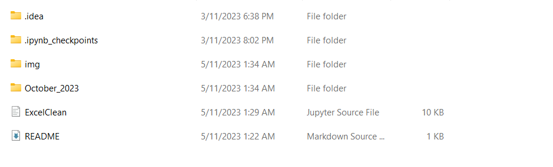
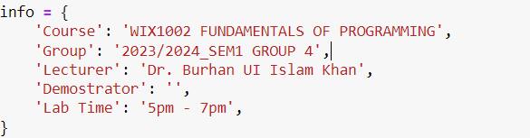
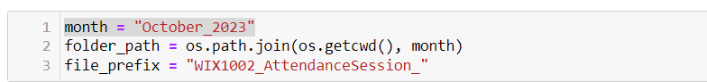

# Basic Workflow

## Guidance

1. Start by cloning this GitHub repository to your local machine.
2. Next, download the student list, which is typically named as "courseid_151_participants.xlsx," and place it in this repository.
3. Download the weekly attendance files for the students, with file names starting with "WIX1002_AttendanceSession_," and organize them into folders using the naming convention "month_year" within this repository. For example, you can create a folder named "October_2023."

4. Now, proceed to edit the information in the specified cell. You can refer to the image for guidance.

5. Don't forget to customize the folder name within the `month` variable as required. Refer to the second image for clarification. 
6. To generate the `.xlsx` file, simply click on "Run All Cells." The final output will be named `Final_Attendance_{month}`. It's worth noting that this process is fully automated and doesn't require any manual copying or additional styling.
